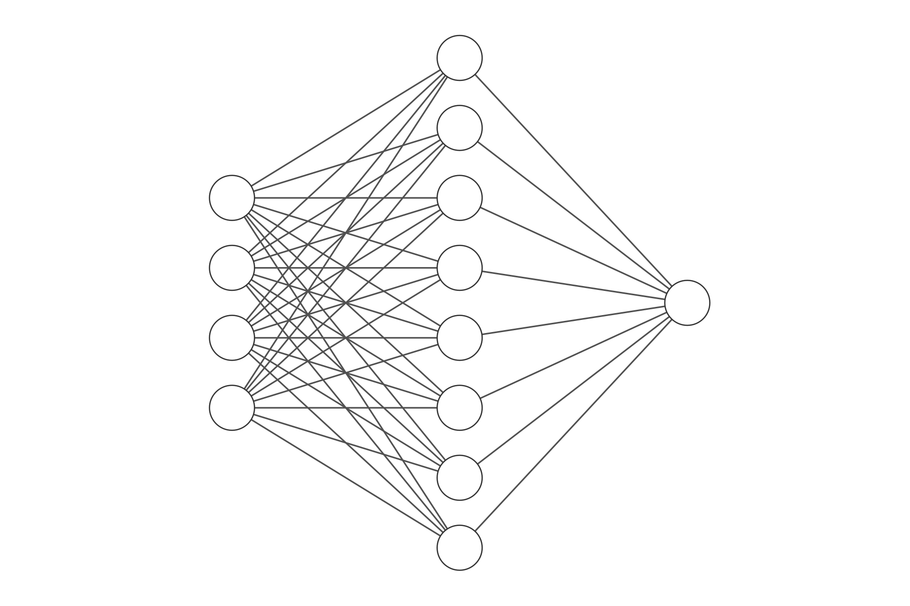

<p align="center"><i>A network created with siliconnn for classifying the <a href="https://archive.ics.uci.edu/ml/datasets/iris">Iris dataset</a>.</i></p>

# (silicon)nn

## Contents
- [Introduction](#introduction)
- [Features](#features)
- [Non-features](#non-features)
- [Demos](#demos)
- [Pure assembly or not?](#pure-assembly-or-not)

## Introduction
Siliconnn is a small yet surprisingly featureful neural network implementation,
written in pure ARM64 (AArch64) assembly for Apple Silicon. Included in this
repository is the arm64 assembly source as well as the C reference
implementation (which I also wrote from scratch, specifically for this project)
that the assembly code was based upon.

To be clear, siliconnn does _not_ depend on its C reference implementation, nor
does it depend on any C standard library
functions[<sup>ish</sup>](#pure-assembly-or-not); no `malloc`, no `atoi`, no
`printf`. Everything that is needed is implemented from scratch in assembly.

Both folders have their own READMEs containing some more specific technical
details about their implementations, as well as `Makefile`s; running `make` in
each will generate three demos (the demos behave identically between the
reference implementation and siliconnn). See [here](#demos) for details on and
example outputs for each demo.

## Features
- **CSV parsing**. You can load training data in through CSV files. There are
  some limitations; only numerical values are allowed, labels must be integers,
  and the label column must be first. But besides this, the CSV parser is pretty
  durable:
  - It correctly interprets missing/empty cells (`,,`) as 0
  - It can parse floats flexibly, so long as they are not in scientific
    notation. e.g. `10.`, `-.002`, `3`, `3.14159` all parse correctly.
  - If there is a single syntax error in a cell, it parses as much of the number
    it can and skips forward to the next cell.
  - If there are more cells in a row than expected, the extraneous cells are
    skipped.
  - Positive and negative labels are also supported.
- **Feature normalization**. This is such an important step for most ML tasks,
  it's included as a feature here. Once data is loaded via CSV, features can be
  normalized, which adjusts all attributes to have mean of 0 and standard
  deviation of 1. This ensures no one particular attribute unfairly outweighs
  other attributes during training.
- **Shuffling**. Shuffling is also quite a commonly-needed utility; you might
  want to shuffle your examples before train-test-split (e.g. the Iris dataset
  comes sorted by label, definitely not what we want), or shuffle your examples
  between epochs during training. Siliconnn can shuffle the examples in a
  dataset using Fisher-Yates on top of its own PRNG implementation.
- **Train-test-split**. You put in one dataset, you get back two datasets which
  you can use as you please. Typically, you use one for training, and use the
  other for validating your model, i.e. checking how well it generalizes to
  unseen data.
  - The API here is inspired by [Sklearn's
    `train-test-split`](https://scikit-learn.org/stable/modules/generated/sklearn.model_selection.train_test_split.html)
    in that you can specify the ratio of test size to train size.
  - This is highly memory-efficient; there is no underlying duplication of the
  data. You can think of the two datasets you get back as two disjoint "views"
  of the same data.
- **Printing datasets**. Just for debug purposes, prints out all the examples in
  a dataset with their labels in a CSV-esque format.
- **Feedforward neural networks with one hidden layer**. This is the heart of
  the project.
  - Sigmoid activation on the hidden layer.
  - Layers are fully connected.
  - Single output neuron corresponding to prediction (no sigmoid applied, but
    there is a bias term)
  - Adjustable input and hidden layer size. Amount of space allocated for the
    network is dynamically computed depending on these settings.
- **Training with stochastic gradient descent**. The batch size is not tunable
  as of now (always 1).
  - You can specify learning rate + number of epochs.
  - Logs helpful info (epoch number, average L2 loss) to the console after each
    epoch to aid in hyperparameter tuning.
- **Loss computation**. Siliconnn can compute a network's mean squared error
  over a given dataset.
- **Saving/loading models**. Want to pretrain a model, dump it to a file, and
  recover the model somewhere else without having to retrain it? Siliconnn can
  do that.
- **Legibility**. The assembly source is readable (well, about as readable as
  assembly can get). It is written letter-for-letter by hand, with zero help
  from compilers, and I personally think it shows; every instruction has a
  logical and clear reason for being there (unlike `gcc` output, which takes a
  decent bit of effort to decipher), and there's generally more comments than
  code.
- **Resource management**. Siliconnn dynamically allocates precisely as much
  memory as it needs to represent the network and datasets (no more and no
  less), deallocates whatever it allocates by providing `destroy` functions for
  everything, closes all of the files it opens, etc.
- **Error checking**. System calls can fail for various reasons, and siliconnn
  exits gracefully on failure. I didn't have it print any error messages (since
  that would be extremely tedious without `perror` or `printf`), but it will
  return one of the following unique non-zero exit codes depending on the reason
  of the crash:
  
  | code | crash reason |
  |------|--------------|
  | 1 | nn_init mmap failed |
  | 2 | nn_destroy munmap failed |
  | 3 | nn_save failed to open file for writing |
  | 4 | nn_load failed to open file for reading |
  | 5 | nn_load failed to get file size info (fstat) |
  | 6 | nn_load mmap failed |
  | 7 | nn_load munmap failed |
  | 8 | ds_destroy munmap failed |
  | 9 | ds_deep_destroy munmap failed |
  | 10 | ds_load mmap failed for data block |
  | 11 | ds_load failed to open file for reading |
  | 12 | ds_load failed to get file size info (fstat) |
  | 13 | ds_load failed to mmap the file |
  | 14 | ds_load mmap failed for examples block |
  | 15 | ds_load munmap failed for file |
  
## Non-features
- **Portability**. This has been tested on my M1 Macbook Pro, and I would assume it would work on any other Apple Silicon Mac, but I don't have access to an array of
  Apple devices to test this. And I am almost certain it won't run anywhere else. This is just the unfortunate reality of assembly.
- **Practicality**. If you are using Siliconnn unironically, why?
- **Speed**. This does not take advantage of GPU compute, or even SIMD (yet!). Thus it is almost assuredly slower than most NN implementations.
- **Flexibility**. Neural networks with 1 hidden sigmoid layer and 1 output can do a decent job at quite a lot of tasks, but not all. I won't be implementing
  extra layers, or other activation functions, or other architectures (e.g. CNN, RNN) anytime soon, again because this is meant to be more of a teaching/learning
  experience than practically useful.

## Demos
Siliconnn comes with three demos: `demo1`, `demo2`, and `demo3`. You can build
each demo individually in either `siliconnn` or the reference implementation
with `make demo<n>` (where `n` is the number of the demo to build), or you
can build all of them with `make all`.

### `demo1`
This demo demonstrates loading the [UCI
Wine](https://archive.ics.uci.edu/ml/datasets/wine) dataset, normalizing
features, splitting into training and testing sets, training on the train set
for 100 epochs, and printing the average loss over the held-out test set.
<details>
  <summary>Example output:</summary>
  
  ```
  ----------TRAIN SET-----------
  0 | 1,0.08,-0.75,-0.97,-1.19,-0.12,0.16,0.61,-0.65,-0.38,-0.58,0.97,0.11,0.86
  1 | 1,0.93,-0.72,1.21,0.00,2.26,1.04,0.71,1.11,-0.42,0.14,1.28,0.54,1.55
  2 | 3,0.87,2.97,0.30,0.30,-0.33,-0.98,-1.42,1.27,-0.93,1.14,-1.39,-1.23,-0.02
  3 | 3,-0.19,0.55,0.89,1.35,0.08,0.03,-1.43,1.35,-1.36,-0.05,-0.29,-0.65,-0.49
  4 | 2,-1.49,-0.18,1.51,2.70,-0.54,-0.26,0.21,1.75,0.29,-0.89,0.05,-0.24,-0.89
  5 | 2,-1.96,-1.43,0.48,0.45,-0.82,0.29,-0.01,0.46,-0.26,-0.85,0.62,-0.42,-0.99
  6 | 3,0.20,0.22,0.01,0.15,1.42,-1.03,-1.35,1.35,-0.22,1.83,-1.56,-1.40,0.29
  7 | 2,-0.71,0.19,-0.35,0.75,-0.68,-0.98,-0.19,2.40,-0.29,-1.02,-0.42,0.97,-1.37
  8 | 1,1.50,-0.57,-0.24,-0.95,1.28,1.44,0.97,-0.82,0.76,0.57,-0.07,0.98,0.71
  9 | 3,0.39,0.81,0.04,0.60,-0.54,-0.58,-1.27,0.71,-0.59,1.45,-1.78,-1.40,-0.30
  10 | 1,0.19,0.02,1.10,-0.26,0.08,0.80,1.21,-0.49,2.13,0.26,0.31,0.78,1.39
  11 | 2,1.06,-0.74,1.10,1.65,-0.96,1.04,0.83,-1.22,0.48,-0.72,1.76,0.77,-1.07
  12 | 2,-0.87,-0.65,-0.57,0.27,0.22,-1.91,-1.01,0.06,-0.22,-0.86,-0.22,-1.11,0.39
  13 | 2,-1.13,-1.08,0.52,1.35,-1.52,-0.47,-0.45,0.30,-0.33,-1.23,1.54,0.15,-0.37
  14 | 2,-0.34,-0.47,-0.60,-0.20,-0.96,-0.15,0.50,-0.82,0.31,-0.50,0.88,0.74,-0.10
  15 | 2,-1.13,-0.23,-2.43,-0.59,-0.19,-0.10,0.14,-0.82,-0.33,-0.76,1.37,0.49,-0.11
  16 | 2,0.13,-1.19,-2.43,-1.34,-1.52,1.09,1.15,-0.82,1.20,0.10,0.71,0.80,-0.77
  17 | 2,-1.03,-0.65,-0.20,0.99,-0.68,-0.82,-0.34,0.54,-0.05,-1.12,1.63,-0.49,-0.80
  18 | 2,-0.77,-0.63,-0.24,1.50,-0.82,-0.12,0.42,0.30,0.54,-1.27,-0.29,0.23,-1.28
  19 | 2,-1.13,-0.84,0.48,0.90,-1.10,0.42,0.26,0.54,-0.96,-0.93,-0.12,0.81,-1.15
  20 | 1,2.25,-0.62,-0.71,-1.65,-0.19,0.80,0.95,-0.57,0.68,0.06,0.53,0.33,0.94
  21 | 2,-1.65,-0.40,-1.63,-1.04,-0.19,-1.09,-0.46,-0.17,-0.77,-0.54,1.19,-0.66,-1.01
  22 | 1,0.50,1.34,-0.90,-0.20,-0.68,0.24,0.65,-0.74,-0.19,-0.33,-0.20,0.54,0.91
  23 | 2,-0.60,-0.54,-1.41,0.30,-1.03,-0.15,-0.10,-0.33,-0.19,-0.91,0.36,1.35,-0.23
  24 | 2,-0.87,0.44,-0.53,-0.44,-0.82,0.24,0.22,-0.90,0.69,-1.25,0.84,0.97,-1.45
  25 | 3,1.39,1.58,1.36,1.50,-0.26,-0.39,-1.27,1.59,-0.42,1.79,-1.52,-1.42,-0.59
  26 | 2,0.60,-0.60,-0.46,1.35,-0.89,-0.66,-0.19,-0.74,-0.98,-0.57,0.09,0.23,-0.87
  27 | 1,1.70,-0.41,0.04,-2.25,0.15,1.61,1.61,-0.57,2.39,1.05,1.06,0.54,2.54
  28 | 2,-1.70,-0.31,-0.31,-0.44,-0.12,1.16,0.23,-1.54,-0.42,-0.78,0.88,0.49,-1.27
  29 | 3,0.44,0.20,-0.06,0.15,-0.75,-1.43,-1.53,0.06,-1.66,0.23,-1.12,-0.20,0.10
  30 | 3,0.71,0.21,1.18,1.50,0.36,-1.19,-1.19,0.22,-0.08,1.55,-0.95,-1.14,0.00
  31 | 3,-0.22,0.92,-0.24,0.00,-0.82,-1.30,-1.37,0.30,-1.08,2.25,-1.04,-1.21,-0.19
  32 | 3,0.09,1.40,-0.02,0.60,0.93,-1.41,-0.64,-0.17,-0.79,1.87,-1.69,-1.81,-0.62
  33 | 2,-0.82,-1.20,-1.52,-1.40,2.54,-0.63,-0.17,-0.09,2.04,-0.71,0.44,-0.42,0.00
  34 | 2,-0.01,-0.59,0.85,3.15,2.75,1.61,0.86,-1.22,0.64,-0.73,1.54,1.25,0.75
  35 | 1,1.16,-0.54,-0.35,-0.62,0.57,0.93,1.51,-0.33,0.85,1.66,0.71,0.68,1.63
  36 | 2,-0.28,0.98,-1.41,-1.04,-1.38,-1.06,-0.78,0.54,-1.33,-0.71,-1.12,-0.69,-1.19
  37 | 3,-0.28,0.04,-0.31,0.00,-0.96,-1.45,-1.52,0.95,-1.66,2.09,-1.69,-1.38,-0.88
  38 | 3,-0.51,-0.93,-0.97,0.15,0.22,-1.30,-1.45,1.35,-0.33,1.09,-1.65,-1.49,-0.34
  39 | 2,-0.44,-0.87,-1.26,-0.80,0.01,-0.44,-0.62,1.35,-1.70,0.29,0.09,-1.44,-0.94
  40 | 2,-0.34,-0.52,-0.31,0.90,-1.10,-1.46,-0.27,0.95,0.06,-0.76,-0.33,-0.27,-0.82
  41 | 1,0.36,-0.55,-0.82,-0.74,-0.40,0.16,0.16,-0.74,-0.42,-0.47,0.27,0.22,1.71
  42 | 1,1.06,-0.88,-0.35,-1.04,-0.12,1.09,1.12,-1.14,0.45,0.93,0.23,1.32,0.94
  43 | 3,-0.14,0.58,0.12,0.15,0.29,-1.59,-0.81,-0.98,-1.33,0.14,-0.95,-1.68,-0.69
  44 | 1,1.38,-0.76,-0.17,-0.80,-0.33,-0.15,0.40,-0.82,-0.03,-0.02,0.93,0.29,1.69
  45 | 1,0.92,-0.54,0.15,-1.04,-0.75,0.48,0.73,-0.57,0.38,0.23,0.84,0.40,1.82
  46 | 1,0.78,0.68,0.70,-1.28,1.14,0.64,1.00,-1.54,0.12,0.01,0.01,1.05,0.31
  47 | 2,-0.87,-0.83,-1.41,-1.04,-1.03,0.40,0.47,-0.57,0.31,-0.93,1.19,0.18,-1.01
  48 | 2,-0.59,0.08,-0.71,0.45,-0.82,0.40,0.24,-0.82,-0.64,-1.32,-0.25,0.23,-1.34
  49 | 1,1.46,-0.66,0.41,-0.89,0.57,1.61,1.90,-0.33,0.47,1.57,1.19,0.29,2.97
  50 | 2,-0.81,0.10,0.34,0.45,-0.12,0.42,0.08,-0.17,-0.49,-0.97,-0.69,1.08,-0.98
  51 | 3,0.13,-0.39,1.40,1.80,1.14,-0.15,-0.75,-0.82,-0.05,0.88,-1.52,-1.81,-1.02
  52 | 2,-1.91,0.05,0.19,0.15,-0.26,0.96,0.76,-0.33,0.41,-0.78,-0.69,1.09,-0.38
  53 | 1,0.91,-0.59,-0.42,-0.92,1.28,0.48,0.87,-1.22,0.05,0.34,-0.16,0.83,0.99
  54 | 2,0.82,-0.97,-1.63,-0.44,-0.40,-0.31,-0.24,-0.33,-1.50,-0.54,1.19,-0.21,-0.37
  55 | 2,-0.38,-0.72,-0.38,0.36,-1.38,-1.46,-0.57,1.75,0.05,-0.86,0.01,-0.77,-0.80
  56 | 2,-0.71,1.87,1.32,2.10,0.15,-0.15,0.10,0.54,0.20,-1.28,-0.16,0.71,-1.21
  57 | 2,0.06,3.10,-0.86,0.60,-0.96,0.52,0.62,-0.49,0.73,-1.06,-0.99,0.68,-1.16
  58 | 2,0.03,-1.28,-2.39,-1.04,-0.96,-0.55,0.00,-0.98,-0.22,-0.19,1.02,-0.18,-1.13
  59 | 2,-0.49,-0.89,-1.70,-0.29,-0.82,-1.35,-0.67,-0.57,-0.42,-1.12,0.36,0.22,-0.58
  60 | 2,-1.77,-0.25,3.15,2.70,1.35,1.41,3.06,0.87,0.48,0.40,-0.12,1.52,-0.89
  61 | 3,-0.18,0.83,0.78,0.75,0.43,-1.03,-1.43,1.91,-1.10,0.22,-0.38,-0.70,-0.56
  62 | 1,0.69,-0.54,0.34,0.30,1.14,1.06,0.75,-1.30,1.50,0.51,0.09,0.59,1.18
  63 | 1,0.34,-0.62,1.73,-1.19,0.72,0.48,0.65,-0.17,-0.40,-0.19,0.58,0.23,0.42
  64 | 3,-0.16,2.04,0.41,0.60,-0.96,-0.95,-1.38,0.87,-1.28,1.12,-1.83,-1.06,-0.38
  65 | 3,0.61,0.70,0.92,1.35,1.63,-1.43,-0.46,-1.14,-0.59,1.53,-1.61,-1.85,-0.78
  66 | 2,-1.68,-0.24,0.34,0.63,-1.10,-0.55,-0.34,0.95,-0.42,-0.97,0.18,0.19,-0.21
  67 | 2,-0.92,-0.54,-0.90,-0.14,-1.38,-1.03,0.00,0.06,0.06,-0.71,0.18,0.78,-0.75
  68 | 3,0.60,1.12,-0.64,0.00,-0.82,-1.08,-1.55,1.75,-1.24,0.27,-0.64,-1.11,-0.53
  69 | 2,-0.40,-1.21,-0.46,-0.44,-0.05,-0.15,-0.08,-0.49,-0.22,-1.05,1.19,0.77,-0.94
  70 | 3,0.33,1.74,-0.38,0.15,1.42,-1.12,-1.34,0.54,-0.42,2.22,-1.61,-1.48,0.28
  71 | 3,-0.92,1.38,-0.60,-0.29,0.86,-1.46,-1.25,-0.57,-0.79,1.36,-1.34,-0.86,0.34
  72 | 1,1.07,-0.39,1.58,-0.02,0.50,1.04,0.94,0.06,0.29,-0.24,1.28,1.11,0.53
  73 | 3,-0.58,2.84,0.99,1.65,-0.26,-0.80,-1.43,2.16,-0.86,-0.02,-0.60,-1.30,-0.73
  74 | 1,1.71,-0.41,0.30,-1.46,-0.26,0.32,0.49,-0.49,0.68,0.08,0.27,1.36,1.72
  75 | 1,1.60,-0.37,1.29,0.15,1.42,0.80,1.11,-0.25,0.66,0.49,0.49,0.05,1.69
  76 | 2,-1.43,-1.29,0.78,-0.44,-0.40,-0.15,0.18,-1.14,1.33,-0.86,-0.73,0.66,-0.72
  77 | 2,-1.23,-1.27,-1.33,-0.14,-0.96,0.20,0.23,-0.49,-0.28,-1.10,1.85,0.71,-1.49
  78 | 2,-1.28,-1.11,-0.24,0.45,0.08,1.73,0.11,-1.86,0.10,-0.79,0.14,0.73,0.44
  79 | 1,0.87,-0.42,-0.02,-0.86,0.08,0.50,0.85,-0.74,0.17,-0.54,0.66,1.96,0.91
  80 | 1,1.51,-0.56,0.23,-1.16,1.91,0.80,1.03,-0.65,1.22,0.25,0.36,1.84,1.01
  81 | 1,1.30,-0.16,0.89,-0.56,1.49,0.48,0.48,-0.41,-0.59,-0.00,0.44,1.36,1.74
  82 | 1,0.59,-0.47,0.15,0.30,0.01,0.64,0.95,-0.82,0.47,0.01,0.36,1.21,0.55
  83 | 3,-0.23,-0.02,0.12,1.35,-0.12,-1.83,-0.94,-0.74,-1.33,0.27,-1.30,-1.76,-0.59
  84 | 2,-0.87,0.74,-0.57,-0.44,-0.82,0.88,0.96,0.71,2.13,-1.19,2.02,0.30,-1.08
  85 | 3,-0.98,0.62,-0.17,-0.14,-0.26,-1.67,-1.54,0.30,-1.50,0.19,-1.30,-1.10,-0.75
  86 | 1,-0.08,1.31,1.03,-0.26,0.15,0.18,0.38,-0.90,0.68,-0.24,0.31,1.28,0.07
  87 | 1,1.69,-0.34,0.48,-0.80,0.93,2.49,1.46,-0.98,1.03,1.18,-0.42,1.18,2.33
  88 | 2,-1.90,1.26,-1.99,0.00,0.50,1.41,0.55,-0.98,3.48,-0.93,-0.91,0.28,-0.58
  89 | 2,-1.53,0.30,2.02,0.15,0.22,-0.87,0.00,1.91,-0.94,-0.54,1.19,-0.15,-0.44
  90 | 1,-0.18,-0.66,0.56,-0.50,-0.33,0.29,0.34,-0.82,-0.22,-0.48,0.58,1.43,0.85
  91 | 1,1.30,-0.63,-0.31,-1.04,1.84,1.12,1.14,-0.98,0.89,0.25,0.58,1.55,0.10
  92 | 3,1.03,1.60,0.04,0.00,-0.75,-0.79,-1.20,0.95,-0.05,1.70,-1.69,-1.37,-0.84
  93 | 1,2.16,-0.54,0.08,-2.43,-0.61,1.28,1.66,0.54,2.13,0.14,1.28,0.16,1.28
  94 | 1,0.95,-0.39,1.14,-0.71,1.07,1.12,0.76,0.22,0.15,0.53,0.75,0.44,2.00
  95 | 3,-0.17,-0.88,-0.17,-0.44,1.56,-1.25,-0.78,-1.22,-1.14,-0.41,-0.86,-1.86,-0.37
  96 | 2,-0.71,-0.65,-0.64,0.90,0.57,-0.47,0.06,-0.17,0.03,-1.29,0.44,0.49,-1.27
  97 | 2,-1.13,-0.90,-0.24,1.23,-2.08,-0.15,-0.44,0.46,-0.36,-1.43,0.49,0.84,-0.38
  98 | 1,0.77,-0.47,1.21,-0.68,0.86,0.88,0.88,-0.49,-0.22,0.96,1.41,0.37,1.79
  99 | 2,-0.82,-1.10,-0.31,-1.04,0.08,-0.39,-0.94,2.16,-2.06,-0.77,1.28,-1.33,-0.21
  100 | 2,-0.77,-1.25,-3.67,-2.67,-0.82,-0.50,-1.46,-0.65,-2.05,-1.34,0.40,-1.11,-0.72
  101 | 2,-2.43,-0.74,-0.60,0.60,-1.03,0.26,0.14,1.27,0.73,-1.36,3.30,0.36,-1.08
  102 | 1,0.29,0.22,1.84,0.45,1.28,0.80,0.66,0.22,0.40,-0.31,0.36,0.44,-0.03
  103 | 1,0.06,-0.50,-0.97,-0.74,0.50,1.12,0.97,-0.65,0.76,-0.00,-0.33,1.04,0.43
  104 | 3,-0.49,0.11,-0.60,-0.29,-0.40,-1.08,-1.37,2.16,-1.14,0.88,-0.99,-1.45,-0.16
  105 | 2,-1.13,-0.45,-0.17,-0.29,-1.31,-1.11,-0.53,1.27,0.08,-1.14,0.53,-0.48,-0.84
  106 | 3,-0.05,0.99,-0.06,-0.29,0.43,-1.45,-1.33,0.30,-1.14,0.09,-1.21,-1.21,-0.22
  107 | 2,-0.77,-1.13,-0.97,-0.29,-0.82,1.96,1.72,-0.98,0.62,-0.24,0.36,0.22,-0.27
  108 | 2,-0.37,1.37,0.12,1.05,0.08,0.85,0.52,0.54,0.62,-1.07,1.02,0.73,-0.90
  109 | 1,0.88,-0.81,0.48,-0.83,0.57,1.77,1.64,-1.38,0.78,0.75,-0.29,0.36,1.71
  110 | 2,-0.77,-1.08,-0.75,-0.14,-0.89,1.93,1.07,-1.38,0.48,-0.26,1.15,0.36,-1.04
  111 | 1,0.29,1.47,-0.27,-0.59,0.22,0.55,0.60,-0.33,0.12,-0.30,-0.60,0.54,-0.21
  112 | 3,0.90,1.81,-0.38,0.90,-0.82,-1.62,-1.56,1.27,-0.77,0.67,-0.77,-1.21,-0.72
  113 | 2,-1.66,-0.59,0.92,1.95,-0.82,-0.60,-0.42,0.30,-0.43,-1.06,1.76,0.84,-0.58
  114 | 1,1.02,-0.68,0.92,0.15,1.07,1.04,1.37,0.30,0.22,0.66,0.75,-0.05,1.22
  115 | 1,1.08,-0.40,0.81,-1.34,0.08,1.53,1.53,-1.54,0.19,0.16,-0.33,1.33,1.10
  116 | 3,1.08,2.42,-0.49,0.15,-1.38,-2.10,-1.69,0.30,-1.59,-0.06,-1.65,-1.81,-1.05
  117 | 2,-1.71,-0.88,1.21,0.15,-0.40,0.71,0.89,-0.57,1.57,-1.04,0.01,0.91,-0.21
  118 | 2,-1.39,1.77,0.08,0.45,-1.24,0.90,1.00,-1.22,2.31,-0.97,-0.91,1.45,-1.16
  119 | 1,1.70,1.12,-0.31,-1.04,0.15,1.53,1.14,-0.74,1.04,-0.06,0.36,1.16,1.01
  120 | 2,-1.23,-0.74,0.19,0.75,-0.96,-1.35,-0.78,1.11,0.06,-0.63,0.40,0.05,-0.94
  121 | 1,1.35,-0.15,-0.24,-0.44,0.36,1.04,1.29,-1.14,1.38,0.29,1.28,0.78,2.43
  122 | 3,0.76,2.34,-0.06,0.15,-0.54,-0.47,-1.23,0.87,-1.00,-0.28,-0.20,-0.79,-0.62
  123 | 2,-1.23,0.98,-1.33,-0.14,-0.89,-0.47,-0.39,0.06,0.48,-1.63,-0.12,0.61,-0.58
  124 | 1,1.49,1.52,0.26,-0.17,0.79,0.88,0.62,-0.49,-0.59,0.07,-0.38,1.01,1.06
  125 | 3,0.85,0.82,0.63,0.15,0.50,-0.74,-1.47,1.11,-1.38,0.35,0.01,-1.11,-0.21
  126 | 3,0.28,0.86,-0.31,-0.29,-0.12,-0.79,-1.20,1.99,0.48,2.36,-1.74,-1.55,-0.22
  127 | 1,0.62,-0.48,1.03,-0.14,0.72,0.08,0.50,-0.57,-0.08,-0.37,0.62,0.36,1.10
  128 | 3,-0.26,0.29,0.41,0.75,0.86,-1.30,-0.67,-0.98,-0.57,2.48,-2.09,-1.61,-0.84
  129 | 2,0.41,-1.25,-0.02,-0.74,0.72,0.37,-0.73,1.51,-2.05,-0.81,0.27,-0.96,0.00
  130 | 1,0.69,-0.56,-0.20,-0.98,1.21,1.36,1.26,-0.17,1.31,0.46,-0.03,1.08,0.15
  131 | 3,0.49,1.41,0.41,1.05,0.15,-0.79,-1.28,0.54,-0.31,0.96,-1.12,-1.48,0.00
  132 | 1,0.06,-0.25,3.11,1.65,1.70,0.53,0.65,0.87,0.57,-0.63,0.75,0.83,0.26
  133 | 3,-0.08,0.42,1.21,0.45,-0.26,-1.20,-1.53,1.35,-1.47,-0.19,-0.82,-0.42,-0.46
  134 | 2,-1.45,-0.55,-1.77,0.00,-0.96,0.32,-0.39,0.06,-0.29,-1.29,-0.07,-0.24,-1.05
  135 | 1,0.35,-0.32,1.14,-0.80,0.15,1.12,1.20,-0.41,0.12,0.40,0.49,0.32,1.66
  136 | 2,-1.14,-0.15,-0.71,0.45,-1.03,0.48,0.62,0.06,-0.42,-0.99,-0.42,0.94,-1.17
  137 | 3,0.20,2.56,-0.17,0.75,-0.47,-0.88,-1.40,1.99,-0.07,1.22,-1.56,-1.59,-0.06
  138 | 2,-1.47,-0.19,1.36,0.60,2.40,-1.11,-1.04,-1.78,-0.05,-1.10,-0.03,-0.49,-0.38
  139 | 2,-1.43,0.49,-0.49,-0.44,0.86,-0.92,-0.71,0.54,-1.12,-1.04,0.01,-0.12,-0.78
  140 | 2,-0.77,-1.04,-1.63,0.03,-1.52,-0.29,-0.02,-0.74,-0.96,-0.16,0.71,1.22,-0.75
  141 | 2,-0.97,-1.02,-2.25,-0.80,3.59,-0.71,-0.75,-1.78,1.59,-0.95,1.41,0.64,-0.09
  142 | 3,1.65,-0.58,1.21,1.65,-0.12,0.80,-0.72,1.35,1.94,3.43,-1.69,-0.92,-0.27

  ----------TEST SET-----------
  0 | 1,0.90,-0.75,1.21,0.90,0.08,1.12,1.22,-0.57,1.38,0.27,1.02,0.13,1.71
  1 | 1,1.48,-0.51,0.30,-1.28,0.86,1.56,1.36,-0.17,0.66,0.73,0.40,0.33,2.23
  2 | 3,0.59,-0.59,0.99,0.90,-0.75,0.48,-0.93,1.27,1.22,2.89,-1.69,-1.17,-0.40
  3 | 1,0.71,-0.60,-0.02,-0.11,0.43,0.90,1.16,-1.14,0.62,0.79,0.58,0.37,2.44
  4 | 3,-0.37,1.08,-0.02,0.60,0.43,-0.95,-0.83,-1.54,-1.31,-0.02,-0.77,-1.86,-0.46
  5 | 1,0.06,-0.54,-1.19,-2.13,-0.54,0.68,1.24,-1.54,2.31,0.92,0.71,0.42,1.28
  6 | 3,0.64,0.74,1.29,1.20,-0.19,-1.19,-1.51,1.11,-1.82,-0.30,-0.29,-0.77,-0.72
  7 | 1,0.83,-0.45,-0.02,-0.68,0.29,0.20,0.66,0.46,0.66,-0.52,1.19,0.36,0.77
  8 | 1,0.48,-0.50,0.92,-1.01,-0.47,0.88,0.91,-0.17,-0.24,-0.11,-0.16,0.85,1.42
  9 | 2,-1.02,-0.79,0.59,-0.14,0.29,-0.64,-0.28,0.71,-0.98,-0.91,2.16,-0.53,-1.24
  10 | 2,-0.65,-0.73,-0.60,-0.14,4.37,0.32,0.24,-0.33,2.95,-1.06,0.88,0.02,0.60
  11 | 3,-0.60,-0.98,-0.42,-0.59,-1.03,-0.47,-1.45,1.91,-0.59,0.16,-0.91,-1.55,-0.30
  12 | 1,1.02,-0.61,0.85,-0.68,-0.40,0.24,0.96,-1.14,1.22,0.23,1.23,1.07,1.64
  13 | 3,-0.92,2.13,0.63,0.45,-0.75,-1.46,-1.56,1.35,-1.38,-0.52,-0.91,-1.89,-0.08
  14 | 2,-1.45,-0.77,-1.37,0.39,-0.96,-0.50,-0.43,-0.49,-0.10,-1.34,-0.03,1.01,-0.80
  15 | 1,0.06,-0.61,0.67,-0.44,-0.12,0.24,0.40,-0.57,-0.26,-0.34,0.71,-0.14,1.14
  16 | 1,1.50,1.48,0.52,-1.89,1.98,1.12,1.01,-1.30,0.85,0.01,-0.29,1.29,0.04
  17 | 1,1.35,-0.28,0.12,-0.20,0.22,0.72,0.89,-0.33,1.38,0.49,0.49,0.19,0.99
  18 | 1,1.01,-0.52,0.19,-1.65,0.79,2.53,1.71,-0.33,0.48,0.86,0.23,0.91,1.41
  19 | 3,-0.68,0.62,0.99,2.25,-0.19,-0.63,-1.45,2.16,-0.79,1.05,-1.26,-1.24,0.42
  20 | 2,0.06,1.36,-0.17,0.90,-1.03,-1.03,-0.44,1.99,0.05,-0.11,-0.51,-0.84,-0.73
  21 | 3,0.49,2.03,1.80,1.65,0.86,-0.50,-1.07,-0.74,-0.84,1.48,-1.26,-0.97,-0.37
  22 | 2,-0.70,-0.72,-0.27,0.60,-0.96,0.71,1.12,0.22,0.31,-0.48,-1.17,0.32,-1.25
  23 | 3,1.43,0.15,0.41,0.15,-0.61,-0.98,-1.33,0.62,-0.61,2.00,-1.48,-1.27,-0.27
  24 | 1,0.61,-0.47,0.89,0.15,-0.26,0.37,0.58,-0.65,0.12,-0.66,0.71,1.70,0.31
  25 | 3,0.19,1.10,-0.79,0.45,0.15,-1.27,-1.48,0.54,-0.50,-0.45,-1.56,-1.31,0.26
  26 | 2,-0.96,-0.93,-1.55,-0.14,-0.54,0.10,0.01,0.22,0.85,-1.02,-0.42,0.57,-1.38
  27 | 1,1.25,-0.58,-0.57,-1.04,-0.26,0.56,0.30,-0.82,0.68,-0.15,0.36,1.38,0.91
  28 | 3,0.96,0.38,-0.24,0.75,-0.68,-1.51,-1.35,0.38,-0.98,1.95,-1.12,-1.31,-0.42
  29 | 2,-1.18,1.76,0.04,0.75,-1.38,-0.31,-0.28,0.46,-0.42,-1.06,-0.73,-0.05,-0.53
  30 | 2,-0.77,-1.01,0.70,-0.41,-0.12,0.20,0.62,0.06,0.85,-0.19,1.02,-0.44,-0.21
  31 | 3,0.55,1.22,0.85,1.05,0.79,-0.95,-1.11,0.54,-0.22,2.43,-0.47,-1.48,-0.16
  32 | 1,1.11,-0.58,-0.90,-1.04,0.08,1.28,1.36,-1.22,0.96,0.45,-0.20,1.01,0.75
  33 | 1,0.24,-0.49,-0.82,-2.49,0.01,0.56,0.73,-0.82,-0.54,-0.29,0.40,1.11,0.96
  34 | 3,-0.79,1.34,0.04,0.45,-0.82,0.00,-1.11,1.11,-0.96,1.12,-1.74,-1.45,-0.72
  Epoch 0 | Loss: 0.6600538267
  Epoch 1 | Loss: 0.1525161900
  Epoch 2 | Loss: 0.1095086574
  Epoch 3 | Loss: 0.1030051339
  Epoch 4 | Loss: 0.1337560730
  Epoch 5 | Loss: 0.0877329843
  Epoch 6 | Loss: 0.1099894077
  Epoch 7 | Loss: 0.0865526057
  Epoch 8 | Loss: 0.0874703253
  Epoch 9 | Loss: 0.0858206748
  Epoch 10 | Loss: 0.0743366060
  Epoch 11 | Loss: 0.0780008211
  Epoch 12 | Loss: 0.0710733905
  Epoch 13 | Loss: 0.0695956667
  Epoch 14 | Loss: 0.0691819318
  Epoch 15 | Loss: 0.0701484004
  Epoch 16 | Loss: 0.0645743156
  Epoch 17 | Loss: 0.0624020507
  Epoch 18 | Loss: 0.0593411527
  Epoch 19 | Loss: 0.0630728737
  Epoch 20 | Loss: 0.0588246534
  Epoch 21 | Loss: 0.0545840522
  Epoch 22 | Loss: 0.0533566515
  Epoch 23 | Loss: 0.0625797091
  Epoch 24 | Loss: 0.0755213861
  Epoch 25 | Loss: 0.0513866896
  Epoch 26 | Loss: 0.0520318599
  Epoch 27 | Loss: 0.0487199715
  Epoch 28 | Loss: 0.0581601352
  Epoch 29 | Loss: 0.0601601177
  Epoch 30 | Loss: 0.0442920328
  Epoch 31 | Loss: 0.0446631996
  Epoch 32 | Loss: 0.0434194118
  Epoch 33 | Loss: 0.0673315983
  Epoch 34 | Loss: 0.0429781050
  Epoch 35 | Loss: 0.0408119872
  Epoch 36 | Loss: 0.0444309006
  Epoch 37 | Loss: 0.0508625323
  Epoch 38 | Loss: 0.0384338657
  Epoch 39 | Loss: 0.0408395066
  Epoch 40 | Loss: 0.0385241386
  Epoch 41 | Loss: 0.0402983140
  Epoch 42 | Loss: 0.0372308498
  Epoch 43 | Loss: 0.0354163857
  Epoch 44 | Loss: 0.0345775173
  Epoch 45 | Loss: 0.0344331835
  Epoch 46 | Loss: 0.0340904672
  Epoch 47 | Loss: 0.0392845680
  Epoch 48 | Loss: 0.0560829857
  Epoch 49 | Loss: 0.0322188890
  Epoch 50 | Loss: 0.0319389238
  Epoch 51 | Loss: 0.0452488330
  Epoch 52 | Loss: 0.0359404964
  Epoch 53 | Loss: 0.0384974602
  Epoch 54 | Loss: 0.0348837812
  Epoch 55 | Loss: 0.0299807238
  Epoch 56 | Loss: 0.0307275922
  Epoch 57 | Loss: 0.0301634260
  Epoch 58 | Loss: 0.0305905310
  Epoch 59 | Loss: 0.0290004548
  Epoch 60 | Loss: 0.0296853790
  Epoch 61 | Loss: 0.0284387653
  Epoch 62 | Loss: 0.0325876831
  Epoch 63 | Loss: 0.0287895493
  Epoch 64 | Loss: 0.0268047827
  Epoch 65 | Loss: 0.0314876761
  Epoch 66 | Loss: 0.0268408082
  Epoch 67 | Loss: 0.0272745941
  Epoch 68 | Loss: 0.0257270667
  Epoch 69 | Loss: 0.0256347806
  Epoch 70 | Loss: 0.0264502052
  Epoch 71 | Loss: 0.0249035875
  Epoch 72 | Loss: 0.0288035110
  Epoch 73 | Loss: 0.0248458794
  Epoch 74 | Loss: 0.0241749120
  Epoch 75 | Loss: 0.0242662324
  Epoch 76 | Loss: 0.0235061780
  Epoch 77 | Loss: 0.0251674554
  Epoch 78 | Loss: 0.0238066355
  Epoch 79 | Loss: 0.0269978150
  Epoch 80 | Loss: 0.0258137652
  Epoch 81 | Loss: 0.0230189329
  Epoch 82 | Loss: 0.0248139020
  Epoch 83 | Loss: 0.0230041734
  Epoch 84 | Loss: 0.0223860572
  Epoch 85 | Loss: 0.0216566691
  Epoch 86 | Loss: 0.0345188248
  Epoch 87 | Loss: 0.0214871192
  Epoch 88 | Loss: 0.0269221761
  Epoch 89 | Loss: 0.0211155271
  Epoch 90 | Loss: 0.0220907526
  Epoch 91 | Loss: 0.0209723552
  Epoch 92 | Loss: 0.0201724226
  Epoch 93 | Loss: 0.0202920587
  Epoch 94 | Loss: 0.0212200000
  Epoch 95 | Loss: 0.0196821084
  Epoch 96 | Loss: 0.0194049432
  Epoch 97 | Loss: 0.0195181882
  Epoch 98 | Loss: 0.0327861722
  Epoch 99 | Loss: 0.0192719702
  Avg test loss: 0.0533738593
  ```
</details>

### `demo2`
This demo loads the [Iris](https://archive.ics.uci.edu/ml/datasets/iris) dataset,
trains a network on it for 25 epochs, and dumps the trained network to a file.
<details>
  <summary>Example output</summary>
  
  ```
  Epoch 0 | Loss: 1.6004945877
  Epoch 1 | Loss: 0.0931686257
  Epoch 2 | Loss: 0.0545873305
  Epoch 3 | Loss: 0.0668135236
  Epoch 4 | Loss: 0.1112969564
  Epoch 5 | Loss: 0.3379020180
  Epoch 6 | Loss: 0.0439549523
  Epoch 7 | Loss: 0.0388685917
  Epoch 8 | Loss: 0.0635569788
  Epoch 9 | Loss: 0.0828348869
  Epoch 10 | Loss: 0.0820943264
  Epoch 11 | Loss: 0.0795910859
  Epoch 12 | Loss: 0.1993147314
  Epoch 13 | Loss: 0.0393402223
  Epoch 14 | Loss: 0.0358872263
  Epoch 15 | Loss: 0.0388186547
  Epoch 16 | Loss: 0.0349244460
  Epoch 17 | Loss: 0.0502932192
  Epoch 18 | Loss: 0.0463453639
  Epoch 19 | Loss: 0.0530413016
  Epoch 20 | Loss: 0.0336110164
  Epoch 21 | Loss: 0.0333378566
  Epoch 22 | Loss: 0.0406205655
  Epoch 23 | Loss: 0.0429201775
  Epoch 24 | Loss: 0.0338577588
  ```
</details>

## `demo3`
This demo demonstrates loading the pretrained network from the file created by
`demo2` and using it to classify some unlabeled iris examples. The first example
has true label 0, the second label has true label 1, and the third label has
true label 2. Obviously, the network does not know this (we are asking it to
predict these values); the important thing is that it outputs values somewhat
close to the true values for each example.
<details>
  <summary>Example output</summary>
  
  ```
  Predictions:
  0.0531142360
  0.9446105566
  1.7613263579
  ```
</details>

## Pure assembly or not?
As stated previously, siliconnn is implemented in as pure assembly as possible. We do have to end up making some calls `libc` - in particular, system calls and
`exp`.
It _is_ possible to make some system calls without calling `libc`; for example, here's `munmap`:
```asm
MOV	X16, #73
SVC	#0x80
```
In which we move the system call code for `munmap` (73) into the register `X16` and execute the system call.

The problem is that this is not supported by Apple. Apple keeps the codes mostly private and does not document them anywhere, and all attempts I have made
to search for the codes for `fstat` and `mmap` have come up empty. There is a link [here](https://opensource.apple.com/source/xnu/xnu-1504.3.12/bsd/kern/syscalls.master),
and some files deep in my local machine with codes, but everything seems outdated and does not work.

Worse, making system calls directly like above makes the code subject to breaking if Apple ever moves things around without telling anyone.
For these reasons, I have opted to make system calls the way they want me to, simply by calling their C functions with `BL _munmap`, for example.
For consistency, I do this for system calls even that I know can be called without the C library, such as `write` and `open`. Yes, it's unfortunate
that we have to rely on the C library at all, but ultimately the logic of my code barely changes (basically all `MOV + SVC` combos are replaced with
a single `BL`, everything else around it pretty much untouched), and this guarantees the stability of this code in future versions of macOS.

And I cannot figure out how to get `exp` to work. I did find a page in the ARM Aarch64 documentation for [`FEXPA`](https://developer.arm.com/documentation/ddi0596/2021-12/SVE-Instructions/FEXPA--Floating-point-exponential-accelerator-), which appears to be exponential-function related, but whenever I try to
use this function I get a `SIGILL`. And I cannot dig into how the standard library does it, because Apple has hidden the implementation so well
that the .dylib doesn't even exist in the filesystem. So after hitting my head against the wall over this for about two days, I've realized it's
just not worth it and have opted to just call `exp` from `math.h`. If you know how to do it otherwise, open an issue!
