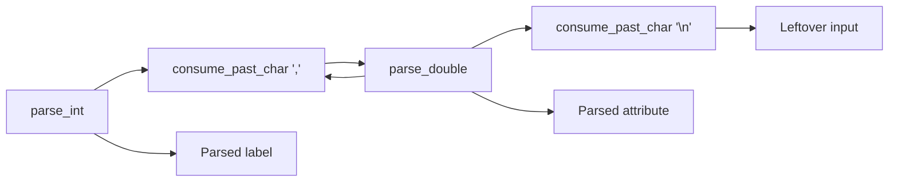

# (silicon)nn source code
Aside from the demos, siliconnn is broadly divided into three major components,
corresponding to the three subdirectories in this folder:
- `util`, the smallest component by far, contains some common subroutines used
  by both `dataset` and `nn`.
- `dataset` contains procedures for loading datasets from CSV files as well
  as common operations on datasets such as shuffling, normalizing, and
	train-test-split.
- `nn` contains procedures for creating neural networks, training them on
  datasets, and saving/loading networks to/from files.

Each assembly file can be viewed as a module, typically containing a single
function; all source files have a header comment that describes exactly what
the file does and how it is used.

Since there's already that, I won't go deep into what each individual file
does here. But I will highlight some higher level technical decisions for each
component below.

## `util`
`util` only contains three files; two of them, `itoa.s` and `dtoa.s`,
respectively contain subroutines for converting integral and floating point
values to strings, and are not much of note.

### Pseudo-random number generation
The third one, `random.s`, is of note; since we do not have access to libc's
`stdlib.h` `rand()`, we have to implement our own pseudo-random number generator
(PRNG). The PRNG is used by siliconnn to shuffle datasets and to initialize
neural networks with randomized starting parameters.

I opted to implement
[XorShift64*](https://en.wikipedia.org/wiki/Xorshift#xorshift*), which I found
after a cursory search to be a PRNG that is both high-quality and easy to
implement. The PRNG can be seeded with the `_seed` function, which sets the
PRNG state to be the system time, in seconds. It can then be used as a random
number source either through `_rand_ul`, which generates a random unsigned long,
or through `_rand_01`, which generates a random float between 0 and 1 (and is
simply a facade over `_rand_ul`).

This code is not present in the reference implementation, since the reference
simply used C's `stdlib.h` random facilities. Instead, I referenced the below
C code:
```C
unsigned long long state = 1;
unsigned long long rand_ul(void) {
    state ^= state >> 12;
    state ^= state << 25;
    state ^= state >> 27;
    state *= 0x2545F4914F6CDD1DULL;
    return state;
}
```
I am not exactly sure of the properties of this PRNG (uniformity, etc.), but in
my testing it appears to get similarly good results as using the libc random,
which is satisfying enough for me.

## `dataset`

### CSV Parsing
By not supporting the full features of CSV files (quotes in particular), we
can build the CSV parser in a way that requires no backtracking or lookahead;
we can just parse the whole thing from left to right, top to bottom, in one
fell swoop.

The CSV parser is built up of three primitive parsers:
- `consume_past_char`, which takes a character and discards everything in
  the CSV input up to and including that character. It returns nothing.
- `parse_int`, which greedily parses an integer value from input, consuming
  everything in the CSV input up until the first non-integer character. For
	example, `parse_int("10983abc")` will return the integer `10983`, and the
	remaining input will be `"abc"`.
- `parse_double`, which does a very similar job as `parse_int`, except it parses
  floating point values instead and so can handle decimal points.

Out of the three primitive parsers, we can build the `parse_data` composite
parser, which can parse a row of CSV data into a training example (its label and
attributes), and consumes that row of CSV data from the input string.



We then run that parser repeatedly to consume all of the CSV data, row by row.

### Memory representation
As discussed above, we parse the CSV file into `data` structs (containing
label plus attributes), one such struct for each row of CSV data. 

Rather than directly exposing those `data` structs, however, we instead expose
pointers to those `data` with datasets.

```
┌────────────────────────────────┐         ┌────────────────┐
│        Underlying data         │         │ dataset struct │
├─────────────┼──────────────────┤         ├────────────────┤
│ row 0 label │ row 0 attributes ├────────🭬│  examples[0]   │
├─────────────┼──────────────────┤         ├────────────────┤
│ row 1 label │ row 1 attributes ├────────🭬│  examples[1]   │
├─────────────┼──────────────────┤         ├────────────────┤
│     ...     │       ...        │         │      ...       │
├─────────────┼──────────────────┤         ├────────────────┤
│ row n label │ row n attributes ├────────🭬│  examples[n]   │
└─────────────┴──────────────────┘         └────────────────┘
```

Why do this? A major benefit of this extra layer of pointers is that datasets
are just lightweight "views" of the underlying data. We can shuffle the data
just by simply shuffling the pointers around, with no need to actually move and
copy the actual data. `ds_shuffle` is simply a direct application of
Fisher-Yates, using `rand_ul` from the `util` component as the PRNG source.

```
┌────────────────────────────────┐         ┌────────────────┐
│        Underlying data         │         │  shuffled ds   │
├─────────────┼──────────────────┤         ├────────────────┤
│ row 0 label │ row 0 attributes ├───🮢🮣───🭬│  examples[0]   │
├─────────────┼──────────────────┤   🮥🮤    ├────────────────┤
│ row 1 label │ row 1 attributes ├───🮠🮡───🭬│  examples[1]   │
├─────────────┼──────────────────┤         ├────────────────┤
│     ...     │       ...        │     🮣──🭬│      ...       │
├─────────────┼──────────────────┤    🮣🮠   ├────────────────┤
│ row n label │ row n attributes ├────🮠    │  examples[n]   │
└─────────────┴──────────────────┘         └────────────────┘
```

Another benefit is that we can have multiple datasets over the same underlying
data, without ever having to duplicate or copy the data between datasets. This
is used in train-test-split, for example, where two datasets are created which
view different subsets of the same underlying data.

This is why we have two separate functions for destroying datasets: `ds_destroy`
and `ds_deep_destroy`. `ds_destroy` simply deallocates memory associated with a
dataset's `examples` array, which is just an array of lightweight pointers to
the actual data. In contrast, `ds_deep_destroy` does that and also frees up the
memory for the underlying data.

This means that if you have two datasets over the same underlying data, and you
deeply destroy one of them, _the other one will become unusable_. This minor
complication is absolutely worth the space and time savings, especially those
that come with larger datasets.

## `nn`
### Memory representation
Neural networks have many parameters. For example, we have to store all of the
weights between the input layer and the hidden layer, all of the hidden layer
biases, the weights between the hidden layer and output layer, etc.

Instead of allocating space separately to store all of those, we instead compute
the total size needed for _all_ parameters (weights and biases from every layer,
as well as outputs) and allocate required space in one big block. The `nn`
struct is then (roughly speaking) just a bunch of pointers into that block of
data.

Below, `i` is the size of the input layer, `h` is the size of the hidden layer.
Note there are `i*h` weights between the input and hidden layer, `h` hidden
layer outputs, `h` hidden layer biases, and `h` weights between the hidden layer
and output neuron.
```
┌─────────────────┐               ┌─────────────┐
│ Reserved block  │               │  NN struct  │
├─────────────────┤               ├─────────────┤
│     quad 0      ├──────────────🭬│ net->w01[0] │
├─────────────────┤               ├─────────────┤
│     quad 1      │   ┌──────────🭬│ net->b1[0]  │
├─────────────────┤   │           ├─────────────┤
│       ...       │   │   ┌──────🭬│ net->o1[0]  │
├─────────────────┤   │   │       ├─────────────┤
│    quad i*h     ├───┘   │   ┌──🭬│ net->w12[0] │
├─────────────────┤       │   │   ├─────────────┤
│       ...       │       │   │   │   net->b2   │
├─────────────────┤       │   │   ├─────────────┤
│   quad i*h+h    ├───────┘   │   │   net->o2   │
├─────────────────┤           │   └─────────────┘
│       ...       │           │
├─────────────────┤           │
│  quad i*h+h+h   ├───────────┘
├─────────────────┤
│       ...       │
├─────────────────┤
│ quad i*h+h+h+h  │
└─────────────────┘
```

This has several benefits, including easier initialization/destruction (single
`mmap`/`munmap` call for both), and easier saving/loading, discussed in the
next section.

### File format for saving/loading
The `.nn` file format produced by `nn_save` and read by `nn_load` is extremely
straightforward, and is documented in the below table.
| Offset hex | Size            | Purpose                                                                                                        |
|------------|-----------------|----------------------------------------------------------------------------------------------------------------|
| 0x0        | 4 bytes         | Stores `i`, the number of input neurons in the network                                                         |
| 0x4        | 4 bytes         | Stores `j`, the number of hidden neurons in the network                                                        |
| 0x8        | 8 bytes         | Stores the learning rate of the network, in IEEE 754 double-precision format                                   |
| 0x10       | 8 bytes         | Stores the layer 2 bias of the network, in IEEE 754 double-precision format                                    |
| 0x18       | `j*(i+3)` bytes | Stores the entire allocated block of memory for the network; all other weights and biases besides layer 2 bias |

## C interop
Siliconnn respects all [ARM64 ABI
conventions](https://learn.microsoft.com/en-us/cpp/build/arm64-windows-abi-conventions?view=msvc-170), and so is fully callable from C. The below header file can be
included in any C program to call siliconnn functions from C.

`siliconnn.h`:
```C
typedef struct data { int label; double* example; } data;
typedef struct dataset {
  data **examples;
  int num_examples;
  int num_attributes;
  data *_mmap_ptr;
} dataset;
typedef struct nn {
  int input_size;
  int hidden_size;
  double learning_rate;
  double* w01;
  double* b1;
  double* o1;
  double* w12;
  double b2;
  double o2;
} nn;
extern int itoa(char *buf, int x);
extern int dtoa(char *buf, double x, int precision);
extern void seed(void);
extern void ds_destroy(dataset *ds);
extern void ds_deep_destroy(dataset *ds);
extern void ds_load(char* fpath, int numrows, int numcols, dataset *ds);
extern void ds_shuffle(dataset *ds);
extern void ds_train_test_split(dataset *original, dataset *train_set, dataset *test_set, double test_ratio);
extern void ds_show(dataset *ds);
extern void ds_normalize(dataset *ds);
extern void nn_init(nn *net, int input_size, int hidden_size, double learning_rate);
extern void nn_destroy(nn *net);
extern double nn_forward(nn *net, double *x);
extern void nn_backward(nn *net, double *x, int y);
extern void nn_train(nn *net, dataset *ds, int num_epochs);
extern double nn_average_loss(nn *net, dataset *ds);
extern void nn_save(nn *net, char *filepath);
extern void nn_load(nn *net, char *filepath);
```
